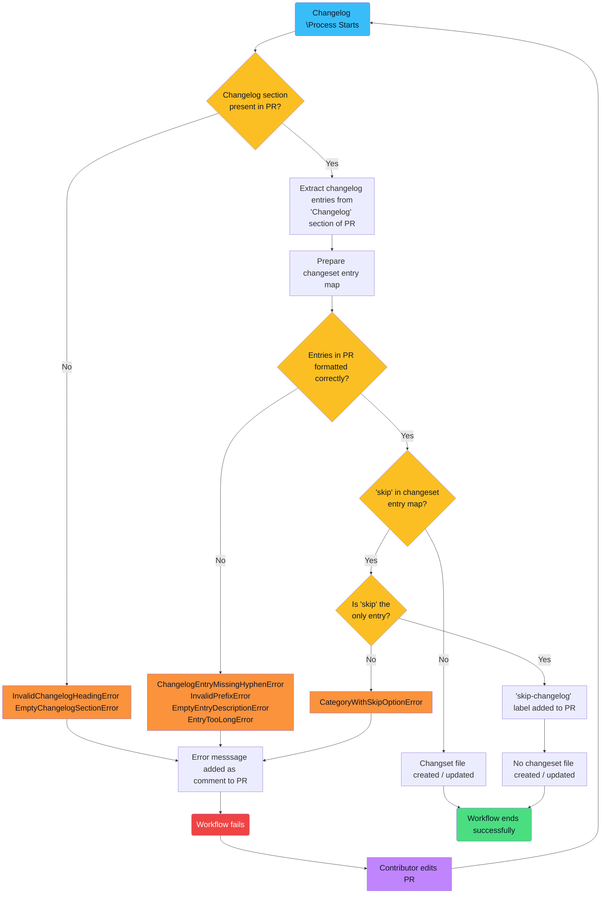

<!-- omit in toc -->
# Feature Details

This document describes the key features of the `OpenSearch-bot` GitHub App. It addresses both the changeset generation process as well as the release documentation process.

<!-- omit in toc -->
## Table of Contents
- [Changeset Generation Process](#changeset-generation-process)
  - [Overview](#overview)
  - [Process Flowchart](#process-flowchart)
- [Release Documentation Process](#release-documentation-process)

## Changeset Generation Process

### Overview

The `OpenSearch-bot` GitHub App subscribes to webhooks that listen for the creation or editing of a pull request (PR). When a PR from a forked repository is opened against an OpenSearch repository, or when that PR is edited, the app extracts the metadata from the PR and checks what a contributor has entered in the "Changelog" section of the PR description.

If a contributor has entered valid changelog entries (see the "Usage" section in the project's [README](../README.md) for details), the workflow will categorize these entries and either create or update a `.yml` changeset file in the `changelogs/fragments` directory of the repository. If this directory does not exist, the app will create one.

The changeset file will include changelog descriptions under their proper category and also add a link to the PR that generated these changes. Below is an example of what the contents of a changeset file will look like:

```yaml
feat:
  - Add a new feature ([#532](https://github.com/.../pull/532))
```

In this example, the path to this file would be `changelogs/fragments/532.yml`.

This changeset file will become part of the code that is merged into the base repository when the PR is approved.

If the app encounters a `- skip` line in the PR description, and there are no other changelog entries present, it will skip the creation of a changeset file, and the process will terminate successfully.

If the app encounters a formatting error in the PR description (e.g., an empty "Changelog" section or an invalid changelog entry), the process will fail, and a custom error message will be added as a comment to the open PR explaining the reason for the failure.

Contributors can then address the error and update their PR description, which will trigger the process to run again.

### Process Flowchart

The following flow chart, built using [Mermaid](https://mermaid.js.org/) syntax, illustrates the logic the changeset generation process follows.

(NOTE: If you are viewing this README in an IDE or code editor, the flow chart will not render. To view the chart, please visit this README file on GitHub's website, which includes built-in support for Mermaid syntax.)



## Release Documentation Process

When a new product release is ready for general availability, OpenSearch maintainers can run the following command from the command line:

```bash
yarn release_note:generate
```
This command executes a script that performs the following actions:
- Extract information from the changeset files in the `changelogs/fragments` directory
- Map the changelog entries in these files to their appropriate changelog section headings
- Generate the changelog section for the new release and add it to the top of the changelog document
- Create a release notes document to accompany the new release
- Delete the changeset files from the `changelogs/fragments` directory